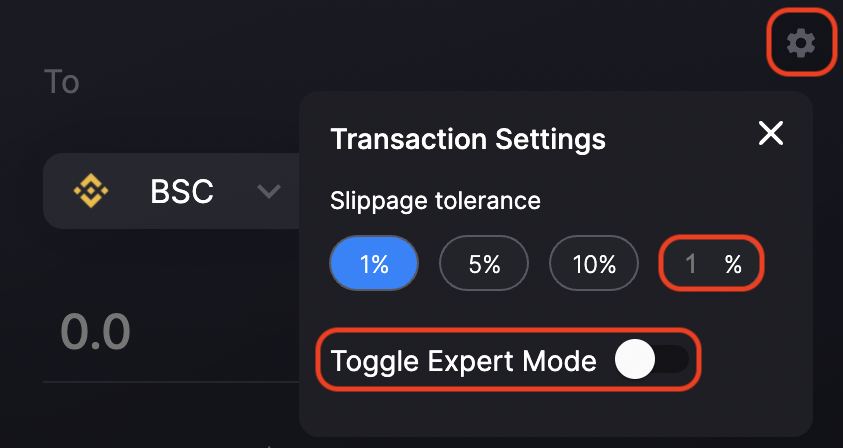

# Bridge Funds Across Chains

In this guide, we will show you how to bridge funds across chains using Router Protocol. Alternatively, you can also check out this video:



**Step 1)** Visit [https://app.routerprotocol.com/swap](https://app.routerprotocol.com/swap).

.png>)

**Step 2)** Select the source and destination chains using the "From" and "To" dropdowns respectively. In this guide, we will do a swap from Polygon to BSC.&#x20;


By default, the "From" chain will be set to the network via which you are connected to website. If you wish to do a same chain transfer, select the same chain as the source and destination network.&#x20;


**Step 3)** Click on the "Fee Token" option to select the token via which you want to pay the transaction fees. You can choose between USDC, ROUTE, MATIC, and BNB.


Ensure that you have a sufficient amount of the chosen fee token in your wallet to pay for the transaction fees. By default, the "Fee Token" will be set to the source chain's native gas token.


**Step 4)** Select the asset you wish to transfer/swap. In this guide, we will demonstrate how to transfer USDT from Polygon to BSC. In case you do not see the token you wish to transfer, you can paste its address in the "Search name or paste address" bar.

.png>)

**Step 5)** Enter the number of tokens you wish to transfer.


It might take a few seconds for the pathfinder algorithm to estimate the number of tokens to be received on the destination side. Behind the hood, Router's pathfinder algorithm finds the most optimal route to transfer your tokens across the two chains.&#x20;


Note: You can use the settings menu to tweak the slippage parameter and toggle the expert mode. Having the expert mode turned on gives you the option to send assets to a different address on the destination chain.

**Step 6)** Once the pathfinder is done estimating the number of tokens to be received on the destination chain, click on "Swap".&#x20;

**Step 7)** Give Router the requisite permissions. In this case, Router asks us for ROUTE approval because we are paying the transaction fees using the ROUTE token.


By default, Router asks you for infinite approval so that you don't need to give approval every time you do a transaction. You can choose not to give infinite approval by toggling the "Infinite Approval" button.


**Step 8)** After approving the tokens successfully, you will see the following screen:

Review the transaction details and click on "Confirm Swap".

**Step 9)** Confirm the transaction from your wallet.

Once you confirm the transaction in your wallet, you can monitor the status of your transaction using the graphic at the bottom of your screen. Once the transaction is complete, check your wallet to ensure that you have received your funds.&#x20;
